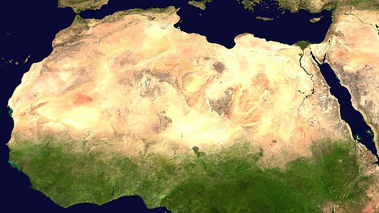
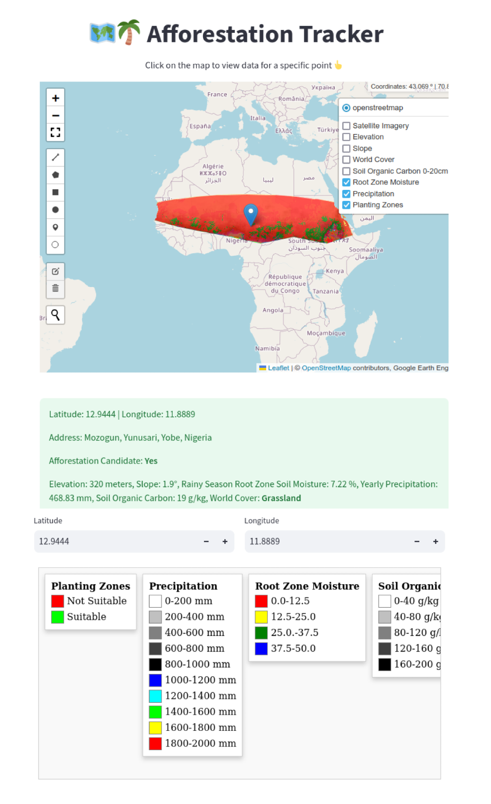
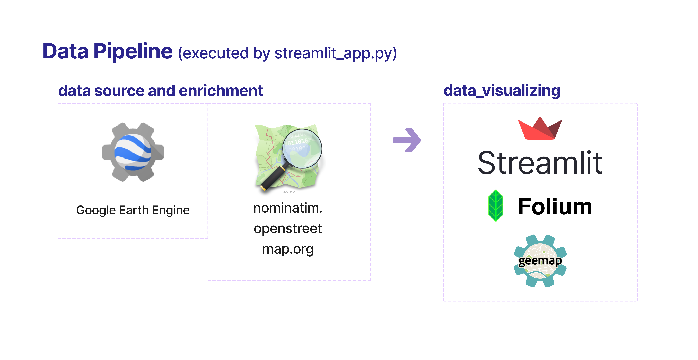

# 🗺️🌴 Afforestation Tracker
## 📋 Overview



This project is inspired by the UN's [**Great Green Wall**](https://en.wikipedia.org/wiki/Great_Green_Wall_(Africa)) initiative in Africa.

The **Afforestation Tracker** is a web-based application designed to monitor and analyze afforestation potential across the Sahel region. The application utilizes geospatial data from various open-source and commercial platforms to evaluate environmental conditions and identify suitable areas for afforestation efforts.

The system features an interactive map that allows users to explore different data layers, such as:
- Suitability for afforestation
- Soil moisture
- Precipitation
- Soil organic carbon
- Type of vegetation cover
- Slope value
- Elevation
- Satellite imagery

Each data layer is accompanied by a legend for easy interpretation. Users can click on specific points to view detailed information about the selected location, including its suitability for afforestation.

The data pipeline integrates various sources, including the `Google Earth Engine` for environmental data and `Nominatim` for geolocation services. The visualization components are powered by the `Streamlit` framework, combined with `folium` and `geemap` for interactive mapping, providing a seamless user experience accessible via a web interface.

The application is ideal for researchers, environmentalists, and policymakers looking to make informed decisions about afforestation in the Sahel region to support sustainable land management initiatives.

## 📊 Data Visualization



## Data

## 🗂️ Project Structure



### 📚 Key Libraries

**Data Acquisition:**

- [**`ee:`**](https://developers.google.com/earth-engine/guides/python_install)

  _Provides APIs for accessing and processing geospatial data on Google Earth Engine._

**Data Visualization:**

- [**`Streamlit:`**](https://docs.streamlit.io/)
  
  _A framework that simplifies the creation of web apps for data analysis and machine learning, enabling developers to turn data scripts into interactive public web applications with minimal coding._

- [**`folium:`**](https://python-visualization.github.io/folium/latest/)

  _Enables interactive maps in Python by integrating Leaflet.js for geographic data visualization._

- [**`streamlit-folium:`**](https://folium.streamlit.app/)

  _Supports real-time user interaction within the Streamlit app, enabling map-based data exploration and updates based on user clicks and selections._

- [**`geemap:`**](https://geemap.org/)

  _Enhances maps with advanced controls and efficient management of Google Earth Engine layers, supporting interactive layer display, coordinate display, and popups._

## 📦 Requirements

Refer to the [`Pipfile`](Pipfile) for dependencies.

## ⚙️ Installation

Before running the app for the first time, set up the `.env` file with the following [values](https://developers.google.com/earth-engine/guides/app_key):

```plaintext
 YOUR_ACCESS_TOKEN: The full path to your GEE service account JSON key file.
 SERVICE_ACCOUNT: The email address of your GEE service account.

 ```

To set up the project environment:

```bash
pip install pipenv
pipenv install
pipenv shell
```

## 🔧 Configuration

The configuration for the application is located in the [app/config.py](app/config.py) file. This file centralizes the management of various settings, such as file paths and server settings. It also defines parameters for different data stages, including data acquisition, processing, and visualization:

<details>
  <summary>Click me</summary>
  
  ### Key Configuration Details

  1. **UI Elements:** Static strings and UI elements like titles and subtitles are defined under the `UI_STRINGS` dictionary to ensure consistent presentation across the application.

  2. **Sampling Size:** The Google Earth Engine (`GEE`) sample size is set to `100 meters` (`SIZE_SAMPLE_METERS`), which is used for data collection in the region of interest (`ROI`).

  3. **Region of Interest (ROI):** The `ROI` dictionary defines the coordinates for the Sahel geo-polygon and specifies the periods for soil moisture and precipitation data collection.

  4. **Data Sources:** `GEE` data collections are defined under `GEE_MAP_COLLECTIONS`, which include open-source datasets for rootzone soil moisture, precipitation, elevation, soil organic carbon, world terrain cover, and satellite imagery.

  5. **Visualization Parameters:** The `MAP_DATA` dictionary contains visualization parameters for each data layer, such as bands, color palettes, legends, and display settings. This enables the customization of map layers for satellite imagery, elevation, slope, world cover, soil organic carbon, soil moisture, precipitation, and afforestation candidates.

  ### Example Usage

  The following layers are configured to be displayed with specific visualization settings:
  
  1. **Root Zone Moisture:** Uses a color palette from red to blue, indicating moisture levels from low to high.
  
  2. **Precipitation:** Uses a palette from white through gray to black, then blue to red, representing precipitation levels from 0 mm to 2000 mm.
  
  3. **Afforestation Candidates:** Highlights suitable and non-suitable zones for planting with a simple red-green palette.

  This setup streamlines the process of adjusting visual settings and managing data sources, ensuring that changes in the configuration file are automatically reflected across the app.

</details>

---


### 🌴 Afforestation Category Logic

Details on how data is categorized for afforestation can be found in the: [`app/stages/data_categorization.py`](app/stages/data_categorization.py) file.


## 🔨 Usage

The app can be executed by running the `streamlit_app.py` script found within the `app` directory.

```bash
streamlit run app/streamlit_app.py
```
**🚨 Note**:
The app depends on external data sources, so response times may vary. Ensure you have the latest key to maintain a reliable connection to the `GEE` servers.


## ✅ Testing

To run the tests for this project, follow these steps:

1. Activate the project's virtual environment by running the following command at the root of the project:

```bash
pipenv shell
```

2. Once the virtual environment is activated, run the tests using the appropriate testing framework or command:

```bash
python -m unittest discover
```
---
Ensure all dependencies are installed in the virtual environment before running the tests.

## 💡 Notes

During development, four significant insights were gained:

1. **State management** using [`session_state`](https://docs.streamlit.io/develop/api-reference/caching-and-state/st.session_state) and [`caching`](https://docs.streamlit.io/develop/api-reference/caching-and-state/st.cache_data) in [`Streamlit v1.37.1`](https://docs.streamlit.io/) is unstable and unpredictable when updating UI elements. Their implicit behavior makes them difficult to maintain, leading to silent bugs, particularly when UI elements fail to render or dynamically generated elements via JavaScript do not appear. It is recommended to minimize the use of these functions.

2. **Backend Engine Alternatives:** For applications requiring intensive API calls and complex state management, consider using frameworks like [`Dash`](https://dash.plotly.com/) or [`Flask`](https://flask.palletsprojects.com/en/3.0.x/) instead of [`Streamlit`](https://docs.streamlit.io/). While Streamlit excels at the rapid development of simpler data apps, Dash and Flask provide more robust solutions for managing complex states and backend operations. Learn more about the differences [here](https://www.datarevenue.com/en-blog/data-dashboarding-streamlit-vs-dash-vs-shiny-vs-voila).

3. **Test Data Transformations Directly on Cloud Services:** To streamline development, I first tested data transformations directly in [`Google Earth Engine`](https://code.earthengine.google.com/) (GEE) before implementing them in the app.

4. **Use Data Sources Independent of Cloud Providers:** Leverage external data sources like [`NASA`](https://worldview.earthdata.nasa.gov/), [`UCSB`](https://www.library.ucsb.edu/geospatial/maps), [`iSDA`](https://www.isda-africa.com/isdasoil/), and [`ESA`](https://esa.maps.eox.at/), which are available for free or by subscription. This approach reduces dependency on Google Cloud Platform (`GCP`) services and ensures access even if those services are down. Some of these collections are also available on `AWS`.

## 🧩 Ideas for Further Growth

1. Displaying the user's current latitude and longitude.

2. Calculating afforestation suitability layers for specific plant species, such as:
    <details>
    <summary>Click me</summary>

      ### Trees:
      - **[Acacia senegal](https://en.wikipedia.org/wiki/Acacia_senegal)** (Gum Arabic Tree)
      - **[Faidherbia albida](https://en.wikipedia.org/wiki/Faidherbia_albida)** (Apple-ring Acacia)
      - **[Balanites aegyptiaca](https://en.wikipedia.org/wiki/Balanites_aegyptiaca)** (Desert Date)
      - **[Parkia biglobosa](https://en.wikipedia.org/wiki/Parkia_biglobosa)** (African Locust Bean Tree)
      - **[Adansonia digitata](https://en.wikipedia.org/wiki/Adansonia_digitata)** (Baobab)

      ### Shrubs:
      - **[Ziziphus mauritiana](https://en.wikipedia.org/wiki/Ziziphus_mauritiana)** (Jujube)
      - **[Guiera senegalensis](https://en.wikipedia.org/wiki/Guiera_senegalensis)** (Guiera)
      - **[Piliostigma reticulatum](https://en.wikipedia.org/wiki/Piliostigma_reticulatum)** (Camel’s Foot)
      - **[Combretum micranthum](https://en.wikipedia.org/wiki/Combretum_micranthum)** (Kinkeliba)
      - **[Leptadenia pyrotechnica](https://en.wikipedia.org/wiki/Leptadenia_pyrotechnica)** (Marakh)


    </details>
3. Identifying which plant species are suitable for the clicked location.

## 📜 License

This project is licensed under the terms of the [LICENSE](LICENSE) file located in the project root.